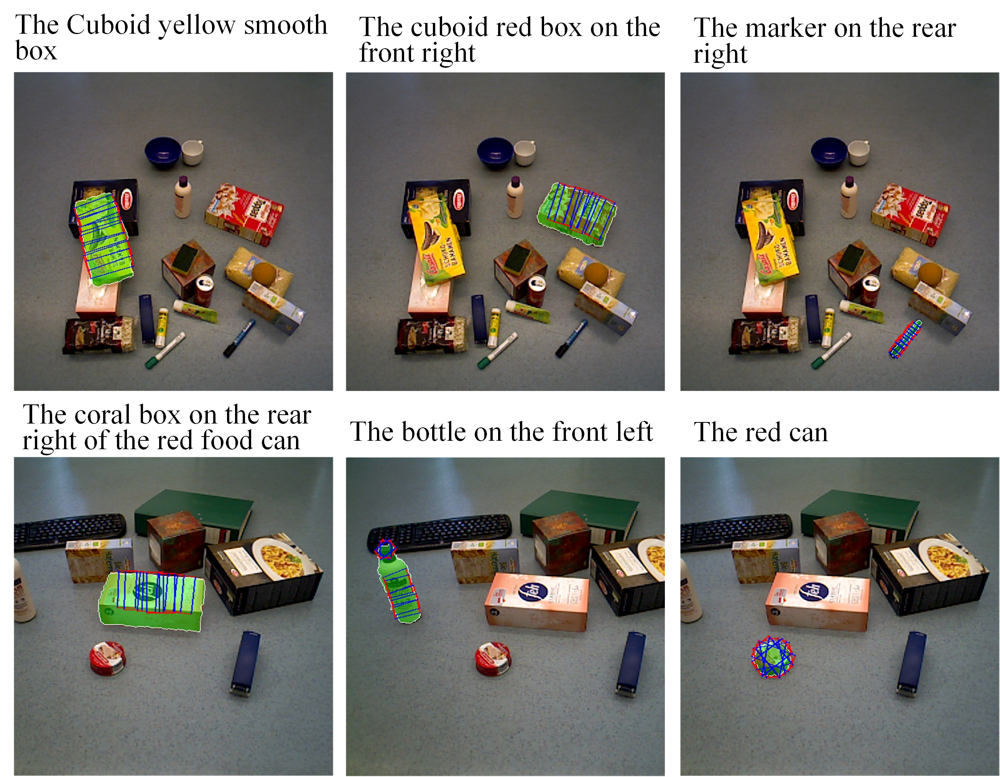

This is the official repository of the paper "Listen, Perceive, Grasp: CLIP-Driven Attribute-Aware Network for Language-Conditioned Visual Segmentation and Grasping".

**Notes and detailed readme will come soon ...** 


### Dataset:

Our RefOCIDGrasp annotation: [Google Drive](https://drive.google.com/drive/folders/1tKdB7tIugG3hKUOCYzxjNajqSqnk6Wo0?usp=drive_link)



```
-data (folder)
----ref-OCID-Grasp (our annotation)
--------train_expressions.json
--------test_expressions.json
--------val_expressions.json

----OCID_grasp (from https://github.com/stefan-ainetter/grasp_det_seg_cnn)
--------ARID10
--------ARID20

-dataset
----referRGBDDataset.py
```

#### Related datasets

OCID: [URL](https://www.acin.tuwien.ac.at/en/vision-for-robotics/software-tools/object-clutter-indoor-dataset/)

RefOCID: [Github](https://github.com/lluma/OCID-Ref)

OCIDGrasp: [Github](https://github.com/stefan-ainetter/grasp_det_seg_cnn)


### Train

```
CUDA_VISIBLE_DEVICES=0,1 python -m torch.distributed.launch --nproc_per_node 2 --master_port 1024 train_dual_multigpu.py --batch_size 64 --output_dir checkpoints --use_mask --random_rotate --random_crop --random_bright 2>&1 | tee ./terminal_log/referGrasp/multigpu_train_output
```
